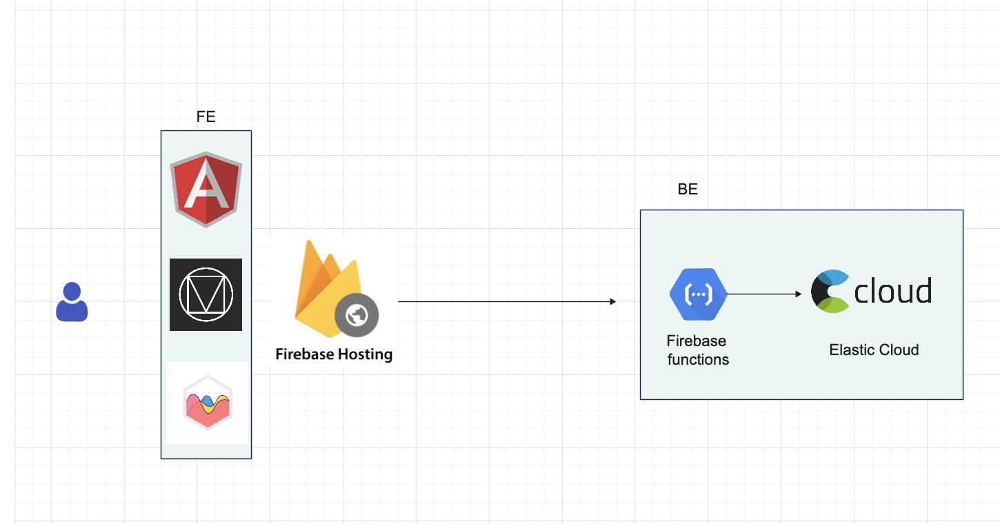

# 311-dash

To run locally, clone the repo and run the angular application in the ui directory

```
git clone https://github.com/b11n/311-dash.git
cd 311-dash
cd ui
npm install
ng serve
```

The backend for this is hosted on firebase cloud functions and talks to an elasticsearch BE 
hence no additional set up is required for BE when running locally. 
There's also a publicly hosted version here - 
https://cal-311.web.app/dashboard

## Highlevel architecture


